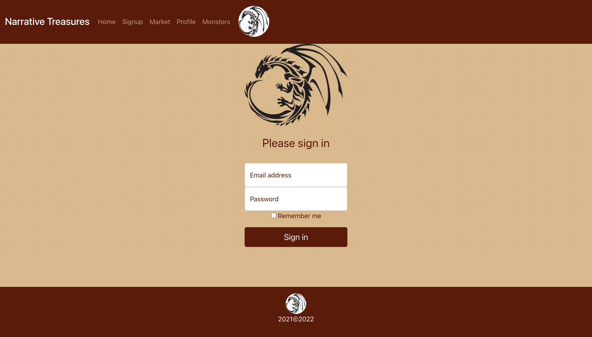

# Narrative Treasures

_Anthony Linebaugh, Graham Clayton, Jacob Parris, Naomi Smith, Neal Smith_

## Table of Contents

- [Overview](#overview)
- [Build](#build)
- [Installation](#installation)
- [Usage](#usage)
- [Contributing](#contributing)
- [Questions](#questions)
- [License](#license)

## Overview

A vision can take you in many directions. You can choose to follow guide lines towards an envisioned objective or you can envision twist and turns to achieve your objective. The beauty of it is, no matter the choice your destined for something great.  Narrative Treasures is here to provide you with the tools that you will need to achieve those objectives with any vision game runners or players may have in mind. Narrative Treasures is an online web application designed to be used by both Game Runners (Dungeon Masters, Game Referees, etc.) and players to create manage and interact with a ‘marketplace economy’ that fluctuates and evolves like a real world economy. Adding a new layer of realism to the game play that takes the pressure off the game runner and allows them to tell a story, without the worry of details in the marketplace. Let this application take the worry away and lets get started today.

## Build

- [React](https://reactjs.org/docs/getting-started.html)
- [Mongoose](https://mongoosejs.com/docs/guide.html)
- [Schema](https://schema.org/docs/schemas.html)
- [Express](https://expressjs.com/)
- [Bootstrap](https://getbootstrap.com/)
- [JWT](https://jwt.io/introduction)
- [node](https://nodejs.org/en/about/)
- [bcrypt](https://www.npmjs.com/package/bcrypt)

## Installation

To install the application you will need nodeJS and use npm install to get all the related packages for this project. In the terminal type npm run develop to interact with the application on your localhost.

## Usage

<!-- Live webpage and image or Screencastify -->

#### Webpage

#### Demo Account

- name: GuestUser
- email: guestuser101@gmail.com
- password: guestuser101

## Contributing

Please reach out via provided Github or Email

## Questions

For any questions about the project, please contact me by either of the following links:

- Email = narrativetreasures@gmail.com

or visit my GitHub profile:

- GitHub - [Narrative Treasures](https://github.com/jparris3213/Narrative_Treasures)

## License

---

 This work is licensed under a <a rel="license" href="http://creativecommons.org/licenses/by-sa/4.0/">Creative Commons Attribution-ShareAlike 4.0 International License</a>.
